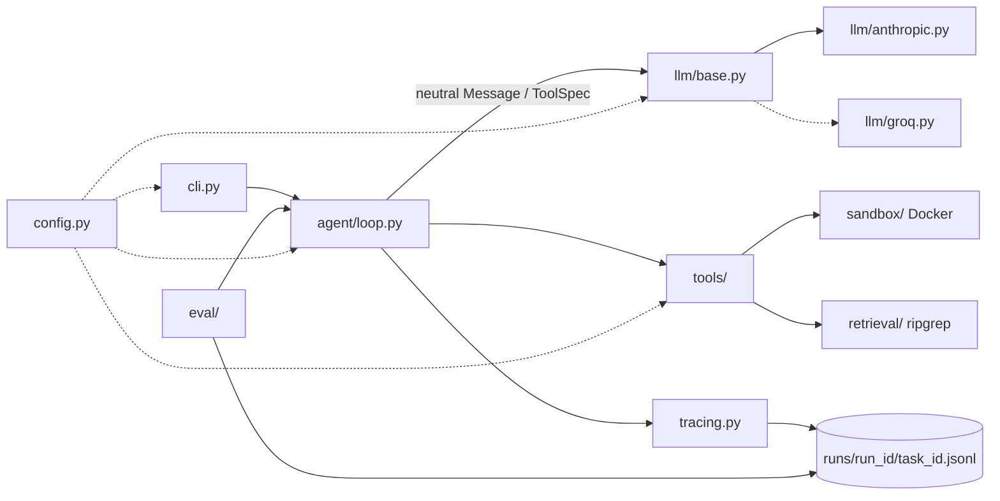

# repair-agent

An autonomous agent that takes a GitHub issue, explores the repository, writes a fix, runs
the tests inside a Docker sandbox, iterates on failures, and opens a pull request. It comes
with an evaluation harness that measures how well the agent actually works.

> **Status: Phase 1 of 6 (scaffold).** Config, the LLM interface with its Anthropic provider,
> JSONL tracing, and the CLI skeleton are done. The sandbox, tools, and agent loop come next.
> `solve` and `eval` are stubs for now.

## Setup

Requires Python 3.11+ and [uv](https://docs.astral.sh/uv/). Docker is required from Phase 2 on.

```bash
uv sync
cp .env.example .env   # then add ANTHROPIC_API_KEY
uv run pytest
```

## Usage

```bash
uv run repair-agent config     # show effective config (secrets masked)
uv run repair-agent ping       # one tiny LLM request to check credentials
uv run repair-agent solve --task benchmark/tasks/<task>.yaml   # Phase 3
uv run repair-agent eval                                        # Phase 4
```

### Configuration

All settings come from environment variables or `.env` (see `.env.example`). Non-secret
settings use the `REPAIR_` prefix with `__` for nesting, e.g. `REPAIR_LLM__MODEL`,
`REPAIR_BUDGET__MAX_ITERATIONS`. Secrets use their standard names (`ANTHROPIC_API_KEY`,
`GROQ_API_KEY`, `GITHUB_TOKEN`), are held as `SecretStr`, and are scrubbed from traces.

## Architecture



Solid arrows are built or under construction; dotted ones are planned for later phases.

| Module | Responsibility | Phase |
|---|---|---|
| `config.py` | Pydantic settings: LLM, budgets, truncation, GitHub allowlist, pricing | 1 ✅ |
| `llm/` | Provider-agnostic interface; Anthropic provider; cost estimation | 1 ✅ (Groq: 6) |
| `tracing.py` | Append-only JSONL trace per task, flushed per event, with secret redaction | 1 ✅ |
| `cli.py` | Typer CLI | 1 ✅ (skeleton) |
| `sandbox/`, `tools/` | Docker sandbox and agent tools | 2 |
| `agent/` | ReAct loop with budgets | 3 |
| `eval/`, `benchmark/` | Benchmark tasks, runner, metrics, report | 4 |
| `github/`, `dashboard/` | Issue → PR flow, FastAPI + React dashboard | 5 |

Design decisions and the alternatives considered are in [DECISIONS.md](DECISIONS.md).

## Results

No eval runs yet. Numbers will appear in `RESULTS.md` once the benchmark exists (Phase 4),
and only from real runs.
