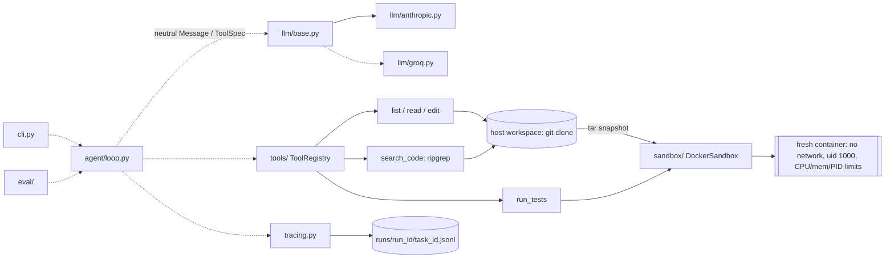

# repair-agent

An autonomous agent that takes a GitHub issue, explores the repository, writes a fix, runs
the tests inside a Docker sandbox, iterates on failures, and opens a pull request. It comes
with an evaluation harness that measures how well the agent actually works.

> **Status: Phase 2 of 6 (sandbox + tools).** Config, the LLM interface, tracing, the Docker
> sandbox, and all six agent tools are done and tested. The agent loop comes next; `solve`
> and `eval` are stubs for now.

## Setup

Requires Python 3.11+, [uv](https://docs.astral.sh/uv/), Docker (Docker Desktop with WSL2 on
Windows), and [ripgrep](https://github.com/BurntSushi/ripgrep) on `PATH`.

```bash
uv sync
cp .env.example .env              # then add ANTHROPIC_API_KEY
uv run repair-agent sandbox build # one-time: builds the sandbox image
uv run pytest                     # Docker tests are skipped if the daemon is down
```

## Usage

```bash
uv run repair-agent config           # show effective config (secrets masked)
uv run repair-agent ping             # one tiny LLM request to check credentials
uv run repair-agent sandbox build    # (re)build the sandbox image
uv run repair-agent sandbox cleanup  # remove containers left by interrupted runs
uv run repair-agent solve --task benchmark/tasks/<task>.yaml   # Phase 3
uv run repair-agent eval                                        # Phase 4
```

### Configuration

All settings come from environment variables or `.env` (see `.env.example`). Non-secret
settings use the `REPAIR_` prefix with `__` for nesting, e.g. `REPAIR_LLM__MODEL`,
`REPAIR_SANDBOX__MEMORY_MB`. Secrets use their standard names (`ANTHROPIC_API_KEY`,
`GROQ_API_KEY`, `GITHUB_TOKEN`), are held as `SecretStr`, and are scrubbed from traces.

## Architecture



Solid arrows are built; dotted ones come in later phases.

### Sandbox

Repo code runs **only** inside Docker. The agent's working copy is a git clone on the host.
File tools read and edit it directly and never execute anything. Each `run_tests` call:

1. packs the workspace into a tar (POSIX names, uid 1000, bytes untouched);
2. creates a fresh container with `network_mode=none`, a non-root user, `cap_drop=ALL`,
   `no-new-privileges`, and limits on CPU, memory (no swap), and PIDs;
3. copies the tar in, runs pytest with a host-enforced timeout, and reads JUnit XML for
   per-test outcomes;
4. always removes the container.

There are no bind mounts, so Windows paths never reach Docker, and line endings are preserved
byte for byte.

### Tools

| Tool | Returns |
|---|---|
| `list_files(path=".", depth=2)` | Indented tree, dirs end with `/`, capped at 500 entries |
| `read_file(path, start_line=1, end_line=None)` | `cat -n`-style lines, paged at 400 with a "call again with start_line=N" hint |
| `search_code(pattern, glob=None)` | `path:line:text`, capped at 100 matches; no match is not an error |
| `edit_file(path, old_str, new_str)` | Exact match, which must be unique; shows the edited region. `old_str=""` creates a new file |
| `run_tests(test_selector=None)` | `Result: PASSED/FAILED/TIMEOUT/...` line, failing ids, pytest output |
| `finish(summary)` | Signals completion to the loop |

Expected failures come back to the model as `is_error` results with an actionable message;
the registry never raises. Outputs over 12,000 chars keep head and tail with an explicit
truncation note.

| Module | Responsibility | Phase |
|---|---|---|
| `config.py` | Pydantic settings: LLM, budgets, tools, sandbox, GitHub allowlist, pricing | 1 ✅ |
| `llm/` | Provider-agnostic interface; Anthropic provider; cost estimation | 1 ✅ (Groq: 6) |
| `tracing.py` | Append-only JSONL trace per task, flushed per event, with secret redaction | 1 ✅ |
| `sandbox/` | Host workspace (git), Docker sandbox, JUnit parsing | 2 ✅ |
| `tools/` | Six agent tools + registry (validation, errors, truncation) | 2 ✅ |
| `cli.py` | Typer CLI | 2 ✅ (`solve`/`eval` stubs) |
| `agent/` | ReAct loop with budgets | 3 |
| `eval/`, `benchmark/` | Benchmark tasks, runner, metrics, report | 4 |
| `github/`, `dashboard/` | Issue → PR flow, FastAPI + React dashboard | 5 |

Design decisions and the alternatives considered are in [DECISIONS.md](DECISIONS.md).

## Results

No eval runs yet. Numbers will appear in `RESULTS.md` once the benchmark exists (Phase 4),
and only from real runs.
