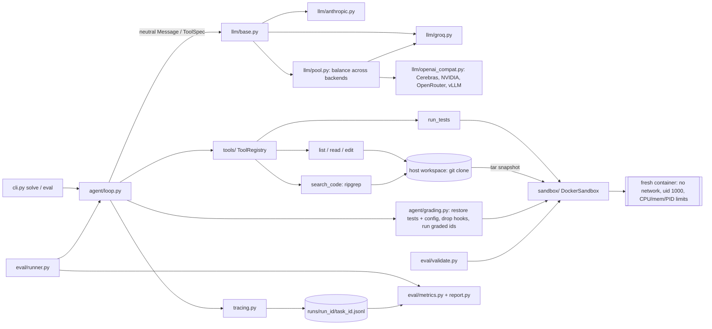

# repair-agent

An autonomous agent that takes a GitHub issue, explores the repository, writes a fix, runs
the tests inside a Docker sandbox, iterates on failures, and opens a pull request. It comes
with an evaluation harness that measures how well the agent actually works.

> **Status: Phase 4 of 6 (benchmark + eval).** A validated 27-task benchmark, tamper-proof
> grading, a resumable `repair-agent eval` runner, and a metrics report. Development runs on
> **Groq's free tier** (`openai/gpt-oss-120b`); Anthropic is still supported. Baseline
> numbers are in [RESULTS.md](RESULTS.md) once a full eval has run.

## Setup

Requires Python 3.11+, [uv](https://docs.astral.sh/uv/), Docker (Docker Desktop with WSL2 on
Windows), and [ripgrep](https://github.com/BurntSushi/ripgrep) on `PATH`.

```bash
uv sync
cp .env.example .env              # then add GROQ_API_KEY (or ANTHROPIC_API_KEY)
uv run repair-agent sandbox build # one-time: builds the sandbox image
uv run pytest                     # Docker tests are skipped if the daemon is down
```

## Usage

```bash
uv run repair-agent config           # show effective config (secrets masked)
uv run repair-agent ping             # one tiny LLM request to check credentials
uv run repair-agent sandbox build    # (re)build the sandbox image
uv run repair-agent sandbox cleanup  # remove containers left by interrupted runs
uv run repair-agent solve --task benchmark/tasks/calc-mean-001.yaml [--keep-workspace]
uv run repair-agent benchmark validate                 # prove every task is well-formed (no LLM)
uv run repair-agent eval --runs 3                      # all tasks x 3 runs -> runs/eval-<id>/report.md
uv run repair-agent eval --resume eval-<id> --runs 3   # continue after a crash or quota stop
uv run repair-agent report eval-<id> [--append-results]
```

### Configuration

All settings come from environment variables or `.env` (see `.env.example`). Non-secret
settings use the `REPAIR_` prefix with `__` for nesting, e.g. `REPAIR_LLM__MODEL`,
`REPAIR_SANDBOX__MEMORY_MB`. Secrets use their standard names (`ANTHROPIC_API_KEY`,
`GROQ_API_KEY`, `GITHUB_TOKEN`, and each pool backend's `api_key_env` such as
`CEREBRAS_API_KEY`), are held as `SecretStr`, and are scrubbed from traces.

## Architecture



Solid arrows are built; dotted ones come in later phases.

### Sandbox

Repo code runs **only** inside Docker. The agent's working copy is a git clone on the host.
File tools read and edit it directly and never execute anything. Each `run_tests` call:

1. packs the workspace into a tar (POSIX names, uid 1000, bytes untouched);
2. creates a fresh container with `network_mode=none`, a non-root user, `cap_drop=ALL`,
   `no-new-privileges`, and limits on CPU, memory (no swap), and PIDs;
3. copies the tar in, runs pytest with a host-enforced timeout, and reads JUnit XML for
   per-test outcomes;
4. always removes the container.

There are no bind mounts, so Windows paths never reach Docker, and line endings are preserved
byte for byte.

### Tools

| Tool | Returns |
|---|---|
| `list_files(path=".", depth=2)` | Indented tree, dirs end with `/`, capped at 500 entries |
| `read_file(path, start_line=1, end_line=None)` | `cat -n`-style lines, paged at 400 with a "call again with start_line=N" hint |
| `search_code(pattern, glob=None)` | `path:line:text`, capped at 100 matches; no match is not an error |
| `edit_file(path, old_str, new_str)` | Exact match, which must be unique; shows the edited region. `old_str=""` creates a new file |
| `run_tests(test_selector=None)` | `Result: PASSED/FAILED/TIMEOUT/...` line, failing ids, pytest output |
| `finish(summary)` | Signals completion to the loop |

Expected failures come back to the model as `is_error` results with an actionable message;
the registry never raises. Outputs over 12,000 chars keep head and tail with an explicit
truncation note.

| Module | Responsibility | Phase |
|---|---|---|
| `config.py` | Pydantic settings: LLM, budgets, tools, sandbox, GitHub allowlist, pricing | 1 ✅ |
| `llm/` | Provider-agnostic interface; Anthropic, Groq and OpenAI-compatible providers; provider pool; cost estimation | 1 ✅ (Groq: 3 ✅, pool ✅) |
| `tracing.py` | Append-only JSONL trace per task, flushed per event, with secret redaction | 1 ✅ |
| `sandbox/` | Host workspace (git), Docker sandbox, JUnit parsing | 2 ✅ |
| `tools/` | Six agent tools + registry (validation, errors, truncation) | 2 ✅ |
| `cli.py` | Typer CLI: config, ping, sandbox, solve, benchmark validate, eval, report | 4 ✅ |
| `agent/` | ReAct loop, budgets, retries, caching, context elision, grading | 3 ✅ |
| `eval/`, `benchmark/` | 27 tasks, validation gate, resumable runner, metrics, report | 4 ✅ |
| `github/`, `dashboard/` | Issue → PR flow, FastAPI + React dashboard | 5 |

### Agent loop

Each iteration is one model call, then all of its tool calls. The results go back as a
single message ending with a budget line, for example
`[budget] iteration 7/30 · test runs 2/10 · tokens 41,200/500,000 · time 1m12s/15m00s`.

- **Stop reasons:** `finished`, `max_iterations`, `token_budget`, `cost_budget`,
  `test_budget`, `context_limit` (the prompt outgrew the per-request limit even after
  trimming; scored as `budget_exceeded`), `timeout`, `refusal`, `no_action`, `llm_error`,
  `sandbox_error`.
- **Budgets:**
  - The token budget counts uncached input, cache writes and output; cache reads are
    excluded.
  - An optional per-task cost cap uses the list-price estimate.
  - Running out of test runs leaves one final turn in which only `finish` is accepted.
- **Retries:** retryable API errors are retried with exponential backoff and jitter, and
  the wait honors `retry-after`.
- **Caching:** prompt caching covers the tools, system prompt, and history. Old tool results
  are replaced with stubs once the context passes 60K tokens.
- **Grading:** after the loop, grading runs with protections against test tampering:
  - original test and test-config files are restored;
  - newly added collection hooks (`conftest.py`, pytest config, `sitecustomize.py`, `*.pth`)
    are deleted;
  - only the FAIL_TO_PASS + PASS_TO_PASS tests run.

  `resolved` requires all of them to pass, so editing tests or monkeypatching from a new
  file can't count as a fix.

Each attempt writes `runs/<run_id>/<task_id>.jsonl` (the trace) and
`runs/<run_id>/<task_id>.result.json`, which records:
- outcome, stop reason, and resolved
- iterations, test runs, and tool calls
- tokens (including cache), estimated cost, and timings
- the model id returned by the API and the temperature sent
- test files and test config the agent edited (restored), and files it added that were
  removed before grading
- final per-test outcomes from the **grading run**, which alone decides `outcome` and
  `resolved`
- the agent's own last test run, kept separately along with whether it disagreed with
  grading
- the diff

Design decisions and the alternatives considered are in [DECISIONS.md](DECISIONS.md).

### Providers

| | Groq (default) | Anthropic |
|---|---|---|
| Model | `openai/gpt-oss-120b` | `claude-sonnet-5` |
| Tool calls | one per turn (gpt-oss has no parallel calls) | parallel |
| Prompt caching | not sent (Groq may cache automatically; cached tokens are recorded) | explicit markers on the system prompt and history |
| Limits handled | 8K tokens/min: `max_completion_tokens` sized to fit, 429 `retry-after`, 413, unparseable-output 400s | 429 / 5xx / `retry-after` |
| Cost recorded | $0.00 on the free tier, plus the list-price equivalent | list price |

Switch providers with `REPAIR_LLM__PROVIDER` and `REPAIR_LLM__MODEL`; both profiles are in
`.env.example`.

#### Provider pool: one model, several free backends

A single free tier covers only 6–10 eval attempts a day. `REPAIR_LLM__PROVIDER=pool` balances
requests across several endpoints that serve **the same model**. By default that is
`openai/gpt-oss-120b` on Groq, then on [Cerebras](https://cloud.cerebras.ai) (OpenAI-compatible,
model id `gpt-oss-120b`). NVIDIA's free catalog does not serve gpt-oss-120b (only 20b), so it
is not in the default pool.

```bash
# .env: add a key from cloud.cerebras.ai next to GROQ_API_KEY
CEREBRAS_API_KEY=...
REPAIR_LLM__PROVIDER=pool

uv run repair-agent ping    # checks every backend separately, with a tool call
uv run repair-agent eval --runs 1
```

- **Routing.** `round_robin` (default) rotates the first backend on each request; `failover`
  always prefers the first (`REPAIR_LLM__POOL_STRATEGY`).
- **Benching.** A backend is skipped until it recovers when:
  - its quota runs out: 429 with a long retry-after or a daily/credit message, or 402;
  - it fails transiently: 5xx, a connection error, or a per-minute 429 (briefly);
  - its key is rejected (401/403) or it doesn't serve the model (404): for the rest of the
    run.

  In each case the same request goes to the next backend immediately.
- **Not failed over:** errors about the request itself (400s, a text-only answer when a tool
  call is required), because another host of the same model would answer the same way.
- **Pool exhausted.** When every backend is benched, the attempt ends as infrastructure and
  the eval stops for a later `--resume`, as with one provider.
- **Same profile on every backend.** Every backend gets the same request shaping (the 8K
  clamp), so a pool eval runs the baseline profile. Only the host changes.
- **Recording.**
  - Traces name the backend that answered each request and any failovers.
  - Results record requests and tokens per backend.
  - The report has a *Backends* table, including the resolve rate of attempts served
    entirely by one backend, so a host that behaves differently shows up.
- **More backends.** Add OpenRouter, Cerebras or a local vLLM as JSON; keys are read from
  the environment or `.env` and scrubbed from traces:
  ```bash
  REPAIR_LLM__POOL='[{"name":"groq","kind":"groq","api_key_env":"GROQ_API_KEY","tpm_limit":8000},
    {"name":"cerebras","base_url":"https://api.cerebras.ai/v1","model":"gpt-oss-120b","api_key_env":"CEREBRAS_API_KEY","tpm_limit":8000},
    {"name":"openrouter","base_url":"https://openrouter.ai/api/v1","api_key_env":"OPENROUTER_API_KEY","tpm_limit":8000,"free_tier":false}]'
  ```
  OpenRouter serves gpt-oss-120b as a paid model (a few cents per million tokens), so it is
  marked `free_tier: false` and its cost is charged in results.
  ```bash
  # To run a *different* model on NVIDIA's free catalog as its own experiment (not the baseline):
  REPAIR_LLM__MODEL=nvidia/nemotron-3-super-120b-a12b
  REPAIR_LLM__POOL='[{"name":"nvidia","base_url":"https://integrate.api.nvidia.com/v1","api_key_env":"NVIDIA_API_KEY","tpm_limit":8000}]'
  ```

A pool eval is a separate eval (its manifest lists the backends), not a resume of a
single-provider one. Details and caveats are in [DECISIONS.md #35](DECISIONS.md).

## Benchmark

27 seeded-bug tasks across 4 small repos. `schedule` depends on `python-dateutil`, which is
baked into its own sandbox image at build time; test containers still have no network.

| Repo | Tasks | Bug types |
|---|---|---|
| `calc` | 6 | off-by-one, wrong conditional, missing edge case, API misuse |
| `textkit` | 7 | off-by-one, wrong conditional, missing edge case, API misuse, multi-file |
| `inventory` | 7 | wrong conditional, missing edge case, API misuse, multi-file |
| `schedule` | 7 | off-by-one, wrong conditional, missing edge case, API misuse, multi-file |

Difficulty: 12 easy, 11 medium, 4 hard.

Every task passes `repair-agent benchmark validate`, which proves each of the following
before any agent runs:
- the correct code passes its suite;
- the seed patch fails exactly FAIL_TO_PASS and keeps PASS_TO_PASS passing;
- grading marks the buggy code unresolved and the correct code resolved;
- the issue describes symptoms only.

### Metrics

`report.md` includes:
- **rates:** resolve rate with a 95% Wilson CI, pass@1, pass@3 (unbiased estimator),
  success rate, and graded-test pass rate;
- **variance:** per-run resolve rates (mean ± std) and flaky tasks;
- **effort and cost:** iterations, test runs, tokens, cost charged and at list price, and
  latency p50/p95;
- **failure modes:** broke other tests, timeout, budget exceeded, gave up, LLM error, wrong
  fix;
- **breakdowns:** by bug type, difficulty and repo, plus a per-task ✓/✗ table.

Attempts lost to infrastructure (quota, outages, Docker) are excluded and re-run on resume.

## Results

**Baseline model: Groq `openai/gpt-oss-120b`, free-tier profile.** Every number in
[RESULTS.md](RESULTS.md) comes from this model. The baseline uses the free-tier profile in
`.env.example` (8K tokens/min limits, tightened context and tool output), and later experiments
must use the same profile to be comparable (DECISIONS.md #34). **Claude Sonnet 5 is untested**: the Anthropic provider is implemented and
unit-tested, but the account has no API credit, so no real Sonnet 5 run exists. The
Groq-vs-Anthropic comparison waits for credits (Phase 6).

So far there are two single-run smoke tests on `calc-mean-001`, plus a 6-task pipeline check.
The full 27 × 3 baseline is next. Benchmark numbers go into RESULTS.md only from real `eval`
reports.
